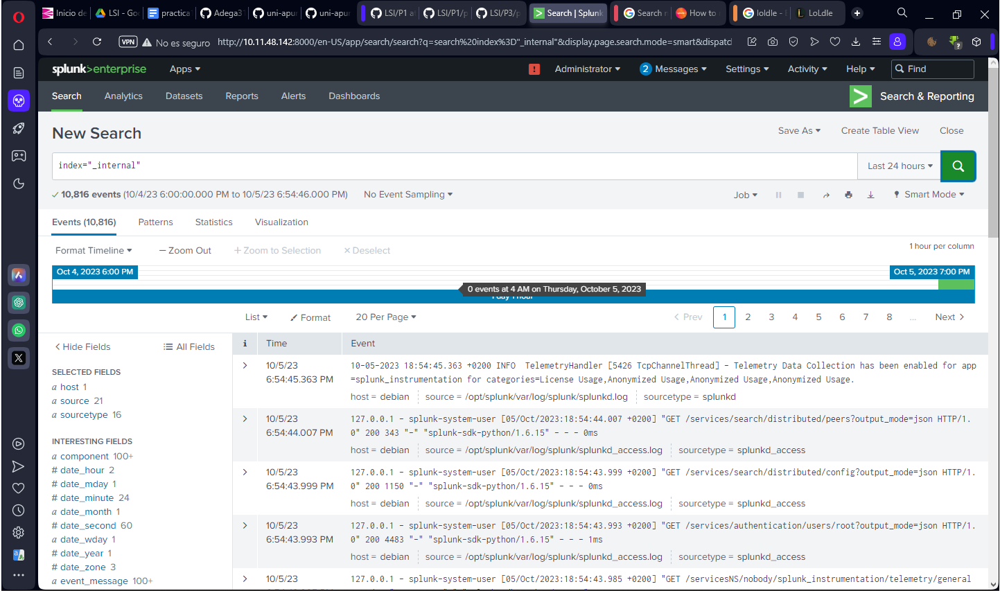
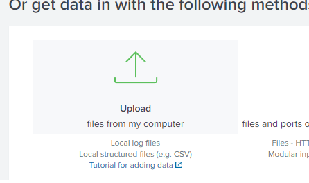
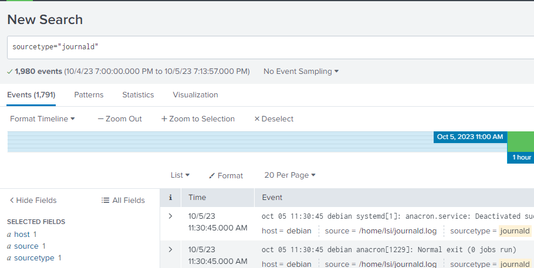
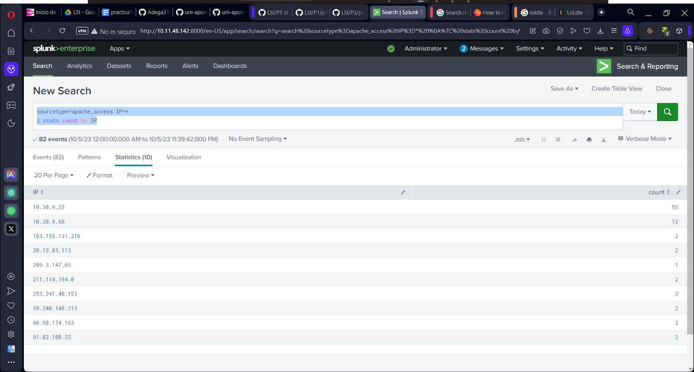
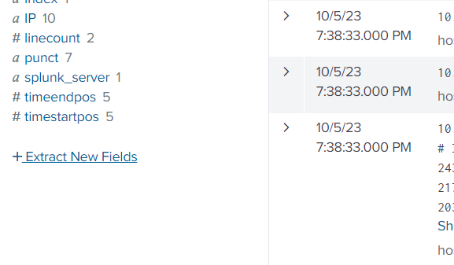
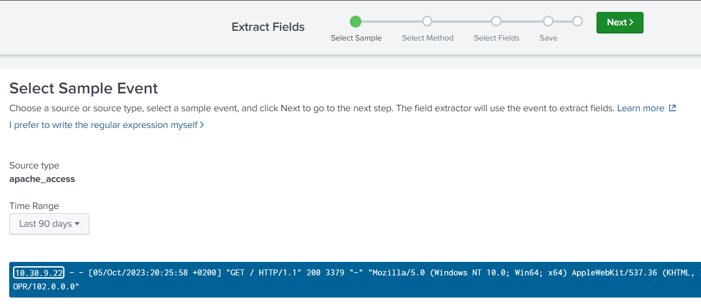
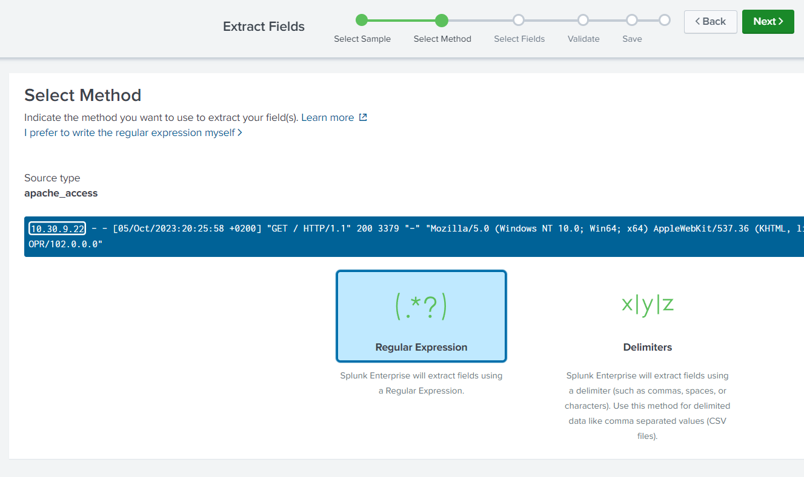
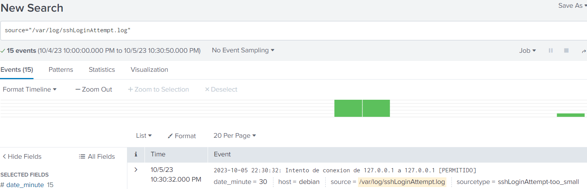

# Configuración inicial

- **Máquina**: 2.2.2
- **IP**: 10.11.48.142

Para conectarse por SSH, contraseña la de la FP:

```sh
ssh lsi@10.11.48.142
```

Cambiar contraseñas de los usuarios **lsi** y **root**.

Establecer **IP estática** en el archivo **/etc/network/interfaces**

```sh
# This file describes the network interfaces available on your system
# and how to activate them. For more information, see interfaces(5).
#source /etc/network/interfaces.d/*
# The loopback network interface
auto lo ens33
iface lo inet loopback
# iface ens33 inet dhcp
iface ens33 inet static
        address 10.11.48.142/23
        gateway 10.11.48.1
        dns-nameservers 10.8.12.47 10.8.12.49 10.8.12.50
```

Después reiniciar el servicio de red, hay dos posibilidades, ejecutar una u otra:

```sh
/etc/init.d/networking restart
```

```sh
systemctl restart network
```

-----

# Práctica 1

**a) Configure su máquina virtual de laboratorio con los datos proporcionados por el profesor. Analice los ficheros básicos de configuración (interfaces, hosts, resolv.conf, nsswitch.conf, sources.list, etc.)**

- /etc/network/interfaces: Es el archivo de configuración de red, permite especificar y definir las interfaces de red (IP, DNS, gateway y máscara)
```sh
lsi@debian:~$ cat /etc/network/interfaces
# This file describes the network interfaces available on your system
# and how to activate them. For more information, see interfaces(5).
#source /etc/network/interfaces.d/*
# The loopback network interface
auto lo ens33
iface lo inet loopback
#iface ens33 inet dhcp
iface ens33 inet static
        address 10.11.48.142/23
        gateway 10.11.48.1
        dns-nameservers 10.8.12.47 10.8.12.49 10.8.12.50
```

- /etc/hosts: Es un archivo de configuración de red, que permite asociar IP a un nombre de dominio sin la necesidad de utilizar un DNS
```sh
lsi@debian:~$ cat /etc/hosts
127.0.0.1       localhost
127.0.1.1       debian

# The following lines are desirable for IPv6 capable hosts
::1     localhost ip6-localhost ip6-loopback
ff02::1 ip6-allnodes
ff02::2 ip6-allrouters
```

- /etc/resolv.conf: Se utiliza para configurar servidores de DNS
```sh
lsi@debian:~$ cat /etc/resolv.conf
domain udc.pri
search udc.pri
nameserver 10.8.12.49
nameserver 10.8.12.50
nameserver 10.8.12.47
```

- /etc/nsswitch.conf: Define el orden de búsqueda de las bases de datos de red
```sh
lsi@debian:~$ cat /etc/nsswitch.conf
# /etc/nsswitch.conf
#
# Example configuration of GNU Name Service Switch functionality.
# If you have the `glibc-doc-reference' and `info' packages installed, try:
# `info libc "Name Service Switch"' for information about this file.

passwd:         files systemd
group:          files systemd
shadow:         files
gshadow:        files

hosts:          files mdns4_minimal [NOTFOUND=return] dns myhostname
networks:       files

protocols:      db files
services:       db files
ethers:         db files
rpc:            db files

netgroup:       nis
```


- /etc/apt/sources.list: Es el archivo en el que se almacenan las direcciones de los repositorios de los que se puede instalar software
```sh
lsi@debian:~$ cat /etc/apt/sources.list
#

# deb cdrom:[Debian GNU/Linux 10.4.0 _Buster_ - Official amd64 DVD Binary-1 20200509-10:26]/ buster contrib main

#deb cdrom:[Debian GNU/Linux 10.4.0 _Buster_ - Official amd64 DVD Binary-1 20200509-10:26]/ buster contrib main

deb http://deb.debian.org/debian bookworm main contribnon-free
deb-src http://deb.debian.org/debian bookworm main contrib non-free

deb http://deb.debian.org/debian-security/ bookworm-security main contrib non-free
deb-src http://deb.debian.org/debian-security/ bookworm-security main contrib non-free

# buster-updates, previously known as 'volatile'
deb http://deb.debian.org/debian/ bookworm-updates main contrib non-free
deb-src http://deb.debian.org/debian/ bookworm-updates main contrib non-free
```

**b) ¿Qué distro y versión tiene la máquina inicialmente entregada?.  Actualice su máquina a la última versión estable disponible.**

```sh
cat /etc/os-release

PRETTY_NAME="Debian GNU/Linux 10 (buster)"
NAME="Debian GNU/Linux"
VERSION_ID="10"
VERSION="10 (buster)"
VERSION_CODENAME=buster
ID=debian
HOME_URL="https://www.debian.org/"
SUPPORT_URL="https://www.debian.org/support"
BUG_REPORT_URL="https://bugs.debian.org/"
```

Para actualizar la máquina:

```sh
apt update -y
apt upgrade -y
apt dist-upgrade
# Editar /etc/apt/sources.list y cambiar de "buster" a "bullseye"
apt update -y
apt upgrade -y
apt dist-upgrade
```

Editar /etc/apt/sources.list
```sh
# deb cdrom:[Debian GNU/Linux 10.4.0 _Buster_ - Official amd64 DVD Binary-1 20200509-10:26]/ buster contrib main

#deb cdrom:[Debian GNU/Linux 10.4.0 _Buster_ - Official amd64 DVD Binary-1 20200509-10:26]/ buster contrib main

deb http://deb.debian.org/debian/ bookworm main
deb-src http://deb.debian.org/debian/ bookworm main

deb http://deb.debian.org/debian-security bookworm-security main contrib non-free
deb-src http://deb.debian.org/debian-security bookworm-security main contrib non-free

# buster-updates, previously known as 'volatile'
deb http://deb.debian.org/debian/ bookworm-updates main contrib
deb-src http://deb.debian.org/debian/ bookworm-updates main contrib
```
```sh	
apt update -y
apt upgrade -y
apt dist-upgrade
```

```

```sh
lsi@debian:~$ lsb_release -a
No LSB modules are available.
Distributor ID: Debian
Description:    Debian GNU/Linux 12 (bookworm)
Release:        12
Codename:       bookworm
```

**c) Identifique la secuencia completa de arranque de una máquina basada en la distribución de referencia (desde la pulsación del botón de arranque hasta la pantalla de login). ¿Qué target por defecto tiene su máquina?. ¿Cómo podría cambiar el target de arranque?. ¿Qué targets tiene su sistema y en qué estado se encuentran?. ¿Y los services?. Obtenga la relación de servicios de su sistema y su estado. ¿Qué otro tipo de unidades existen?.**

Cambiar el target del sistema puede hacer que se comporte de distintas formas, como que arranque con la interfaz gráfica que es como está por defecto. También se puede utilizar para depurar el arranque o que se optimice.

El target por defecto de la máquina se puede ver con:
```sh
lsi@debian:~$ systemctl get-default
graphical.target
```

Se puede cambiar el target de por defecto usando:
```sh
# Y para cambiar el target se ejecuta:
lsi@debian:~$ systemctl set-default <nuevoTarget>

# Para ver los posibles targets se puede hacer
lsi@debian:~$ systemctl list-unit-files --type=target
UNIT FILE                     STATE    PRESET
basic.target                  static   -
blockdev@.target              static   -
bluetooth.target              static   -
boot-complete.target          static   -
cryptsetup-pre.target         static   -
cryptsetup.target             static   -
ctrl-alt-del.target           alias    -
default.target                alias    -
emergency.target              static   -
exit.target                   disabled disabled
factory-reset.target          static   -
final.target                  static   -
first-boot-complete.target    static   -
getty-pre.target              static   -
getty.target                  static   -
graphical.target              static   -
halt.target                   disabled disabled
hibernate.target              static   -
hybrid-sleep.target           static   -
initrd-fs.target              static   -
initrd-root-device.target     static   -
initrd-root-fs.target         static   -
initrd-switch-root.target     static   -
initrd-usr-fs.target          static   -
initrd.target                 static   -
integritysetup-pre.target     static   -
integritysetup.target         static   -
kexec.target                  disabled disabled
local-fs-pre.target           static   -
local-fs.target               static   -
multi-user.target             static   -
network-online.target         static   -
network-pre.target            static   -
network.target                static   -
nss-lookup.target             static   -
nss-user-lookup.target        static   -
paths.target                  static   -
poweroff.target               disabled disabled
printer.target                static   -
reboot.target                 disabled enabled
remote-cryptsetup.target      disabled enabled
remote-fs-pre.target          static   -
remote-fs.target              enabled  enabled
remote-veritysetup.target     disabled enabled
rescue-ssh.target             static   -
rescue.target                 static   -
rpcbind.target                static   -
runlevel0.target              alias    -
runlevel1.target              alias    -
runlevel2.target              alias    -
runlevel3.target              alias    -
runlevel4.target              alias    -
runlevel5.target              alias    -
runlevel6.target              alias    -
shutdown.target               static   -
sigpwr.target                 static   -
sleep.target                  static   -
slices.target                 static   -
smartcard.target              static   -
sockets.target                static   -
sound.target                  static   -
suspend-then-hibernate.target static   -
suspend.target                static   -
swap.target                   static   -
sysinit.target                static   -
system-update-pre.target      static   -
system-update.target          static   -
time-set.target               static   -
time-sync.target              static   -
timers.target                 static   -
umount.target                 static   -
usb-gadget.target             static   -
veritysetup-pre.target        static   -
veritysetup.target            static   -

74 unit files listed.
```

Para ver las dependencias de cada target.
```sh
lsi@debian:~$ systemctl list-dependencies default.target
default.target
● ├─accounts-daemon.service
○ ├─e2scrub_reap.service
● ├─gdm.service
● ├─power-profiles-daemon.service
● ├─pulseaudio-enable-autospawn.service
● ├─switcheroo-control.service
○ ├─systemd-update-utmp-runlevel.service
● ├─udisks2.service
● └─multi-user.target
○   ├─anacron.service
●   ├─avahi-daemon.service
●   ├─console-setup.service
●   ├─cron.service
●   ├─cups-browsed.service
●   ├─cups.path
●   ├─cups.service
●   ├─dbus.service
●   ├─ModemManager.service
●   ├─networking.service
●   ├─NetworkManager.service
●   ├─open-vm-tools.service
●   ├─plymouth-quit-wait.service
○   ├─plymouth-quit.service
●   ├─pulseaudio-enable-autospawn.service
●   ├─rsyslog.service
●   ├─run-vmblock\x2dfuse.mount
○   ├─ssa.service
●   ├─ssh.service
●   ├─systemd-ask-password-wall.path
●   ├─systemd-logind.service
○   ├─systemd-update-utmp-runlevel.service
●   ├─systemd-user-sessions.service
○   ├─tpm2-abrmd.service
●   ├─unattended-upgrades.service
●   ├─wpa_supplicant.service
●   ├─basic.target
●   │ ├─-.mount
○   │ ├─low-memory-monitor.service
○   │ ├─tmp.mount
●   │ ├─paths.target
●   │ ├─slices.target
●   │ │ ├─-.slice
●   │ │ └─system.slice
●   │ ├─sockets.target
●   │ │ ├─avahi-daemon.socket
●   │ │ ├─cups.socket
●   │ │ ├─dbus.socket
●   │ │ ├─systemd-initctl.socket
●   │ │ ├─systemd-journald-audit.socket
●   │ │ ├─systemd-journald-dev-log.socket
●   │ │ ├─systemd-journald.socket
●   │ │ ├─systemd-udevd-control.socket
●   │ │ └─systemd-udevd-kernel.socket
●   │ ├─sysinit.target
●   │ │ ├─apparmor.service
●   │ │ ├─dev-hugepages.mount
●   │ │ ├─dev-mqueue.mount
●   │ │ ├─keyboard-setup.service
●   │ │ ├─kmod-static-nodes.service
●   │ │ ├─plymouth-read-write.service
●   │ │ ├─plymouth-start.service
●   │ │ ├─proc-sys-fs-binfmt_misc.automount
●   │ │ ├─sys-fs-fuse-connections.mount
●   │ │ ├─sys-kernel-config.mount
●   │ │ ├─sys-kernel-debug.mount
●   │ │ ├─sys-kernel-tracing.mount
○   │ │ ├─systemd-ask-password-console.path
●   │ │ ├─systemd-binfmt.service
○   │ │ ├─systemd-firstboot.service
●   │ │ ├─systemd-journal-flush.service
●   │ │ ├─systemd-journald.service
○   │ │ ├─systemd-machine-id-commit.service
●   │ │ ├─systemd-modules-load.service
○   │ │ ├─systemd-pcrphase-sysinit.service
○   │ │ ├─systemd-pcrphase.service
○   │ │ ├─systemd-pstore.service
●   │ │ ├─systemd-random-seed.service
○   │ │ ├─systemd-repart.service
●   │ │ ├─systemd-sysctl.service
●   │ │ ├─systemd-sysusers.service
●   │ │ ├─systemd-timesyncd.service
●   │ │ ├─systemd-tmpfiles-setup-dev.service
●   │ │ ├─systemd-tmpfiles-setup.service
●   │ │ ├─systemd-udev-trigger.service
●   │ │ ├─systemd-udevd.service
●   │ │ ├─systemd-update-utmp.service
●   │ │ ├─cryptsetup.target
●   │ │ ├─integritysetup.target
●   │ │ ├─local-fs.target
●   │ │ │ ├─-.mount
○   │ │ │ ├─systemd-fsck-root.service
●   │ │ │ └─systemd-remount-fs.service
●   │ │ ├─swap.target
●   │ │ │ └─dev-sda5.swap
●   │ │ └─veritysetup.target
●   │ └─timers.target
●   │   ├─anacron.timer
●   │   ├─apt-daily-upgrade.timer
●   │   ├─apt-daily.timer
●   │   ├─dpkg-db-backup.timer
●   │   ├─e2scrub_all.timer
●   │   ├─fwupd-refresh.timer
●   │   ├─logrotate.timer
●   │   ├─man-db.timer
●   │   └─systemd-tmpfiles-clean.timer
●   ├─getty.target
○   │ ├─getty-static.service
○   │ └─getty@tty1.service
●   └─remote-fs.target

```

Los servicios se pueden ver con el comando systemctl
```sh
lsi@debian:~$ systemctl list-units --type=service
  UNIT                                LOAD   ACTIVE SUB     DESCRIPTION
  accounts-daemon.service             loaded active running Accounts Service
  apparmor.service                    loaded active exited  Load AppArmor profiles
  avahi-daemon.service                loaded active running Avahi mDNS/DNS-SD Stack
  colord.service                      loaded active running Manage, Install and Generate Color Profiles
  console-setup.service               loaded active exited  Set console font and keymap
  cron.service                        loaded active running Regular background program processing daemon
  cups-browsed.service                loaded active running Make remote CUPS printers available locally
  cups.service                        loaded active running CUPS Scheduler
  dbus.service                        loaded active running D-Bus System Message Bus
  gdm.service                         loaded active running GNOME Display Manager
  ifupdown-pre.service                loaded active exited  Helper to synchronize boot up for ifupdown
  keyboard-setup.service              loaded active exited  Set the console keyboard layout
  kmod-static-nodes.service           loaded active exited  Create List of Static Device Nodes
  ModemManager.service                loaded active running Modem Manager
  networking.service                  loaded active exited  Raise network interfaces
● NetworkManager-wait-online.service  loaded failed failed  Network Manager Wait Online
  NetworkManager.service              loaded active running Network Manager
  open-vm-tools.service               loaded active running Service for virtual machines hosted on VMware
  plymouth-quit-wait.service          loaded active exited  Hold until boot process finishes up
  plymouth-read-write.service         loaded active exited  Tell Plymouth To Write Out Runtime Data
  plymouth-start.service              loaded active exited  Show Plymouth Boot Screen
  polkit.service                      loaded active running Authorization Manager
  power-profiles-daemon.service       loaded active running Power Profiles daemon
  pulseaudio-enable-autospawn.service loaded active exited  LSB: Enable pulseaudio autospawn
  rsyslog.service                     loaded active running System Logging Service
  rtkit-daemon.service                loaded active running RealtimeKit Scheduling Policy Service
  ssh.service                         loaded active running OpenBSD Secure Shell server
  switcheroo-control.service          loaded active running Switcheroo Control Proxy service
  systemd-binfmt.service              loaded active exited  Set Up Additional Binary Formats
  systemd-journal-flush.service       loaded active exited  Flush Journal to Persistent Storage
  systemd-journald.service            loaded active running Journal Service
  systemd-logind.service              loaded active running User Login Management
  systemd-modules-load.service        loaded active exited  Load Kernel Modules
  systemd-random-seed.service         loaded active exited  Load/Save Random Seed
  systemd-remount-fs.service          loaded active exited  Remount Root and Kernel File Systems
  systemd-sysctl.service              loaded active exited  Apply Kernel Variables
  systemd-sysusers.service            loaded active exited  Create System Users
  systemd-timesyncd.service           loaded active running Network Time Synchronization
  systemd-tmpfiles-setup-dev.service  loaded active exited  Create Static Device Nodes in /dev
  systemd-tmpfiles-setup.service      loaded active exited  Create Volatile Files and Directories
  systemd-udev-trigger.service        loaded active exited  Coldplug All udev Devices
  systemd-udevd.service               loaded active running Rule-based Manager for Device Events and Files
  systemd-update-utmp.service         loaded active exited  Record System Boot/Shutdown in UTMP
  systemd-user-sessions.service       loaded active exited  Permit User Sessions
  udisks2.service                     loaded active running Disk Manager
  unattended-upgrades.service         loaded active running Unattended Upgrades Shutdown
  upower.service                      loaded active running Daemon for power management
  user-runtime-dir@1000.service       loaded active exited  User Runtime Directory /run/user/1000
  user-runtime-dir@117.service        loaded active exited  User Runtime Directory /run/user/117
  user@1000.service                   loaded active running User Manager for UID 1000
  user@117.service                    loaded active running User Manager for UID 117
  vgauth.service                      loaded active running Authentication service for virtual machines hosted on VMware
  wpa_supplicant.service              loaded active running WPA supplicant

LOAD   = Reflects whether the unit definition was properly loaded.
ACTIVE = The high-level unit activation state, i.e. generalization of SUB.
SUB    = The low-level unit activation state, values depend on unit type.
53 loaded units listed. Pass --all to see loaded but inactive units, too.
To show all installed unit files use 'systemctl list-unit-files'.
```


Estos son todas las unidades que tiene la máquina
```sh
lsi@debian:~$ systemctl list-units -t help
Available unit types:
service
mount
swap
socket
target
device
automount
timer
path
slice
scope
```

**d) Determine los tiempos aproximados de botado de su kernel y del userspace. Obtenga la relación de los tiempos de ejecución de los services de su sistema.**

Para ver los tiempos de botado se usa el comando systemd-analyse
```sh
root@debian:/home/lsi# systemd-analyze
Startup finished in 5.181s (kernel) + 1min 33.618s (userspace) = 1min 38.800s
multi-user.target reached after 1min 33.590s in userspace.
```
(Ahí había un error que más tarde se solucionó sin saber cómo)

Todos los cambios se podrán ver si reiniciamos por completo la máquina, para ello debemos ejecutar ```shutdown -r now``` en lugar de ```reboot```, porque reboot solo reinicia el kernel, y no hace un reinicio completo como lo hace shutdown.

Después de reiniciar y desactivar algunos servicios cómo:

- **fwupd-refresh.service**: Automatiza la actualización de firmware, si se desactiva se tendrá que actualizar manualmente.
- **cups.service**: Gestiona colas de impresión. Enmascarado
- **NetworkManager.service**: Gestiona la conexión a Internet, pero en nuestro caso no afecta 
  porque estamos usando networking.service
- **avahi-daemon.service**: Permite la detección automática de servicios y anuncios en una red local, son cosas de DNS.
- **wpa_supplicant.service**: Permite las conexiones a Internet a través de Wi-Fi, cómo la máquina es por cable se puede quitar.
- **ModemManager.service**: Gestiona dispositivos de gestión de banda ancha y modems, y las conexiones de datos móviles
- **plymouth-start.service**: Gestiona la carga y visualización de la pantalla de inicio durante el arranque o apagado.
- **modprobe@drm.service**: Da soporte para gráficos avanzados y aceleración 3D.
- **plymouth-read-write.service**: Muestra información sobre el arranque y apagado, como por conexión por SSH no se puede ver eso, se deshabilita.
- **plymouth-quit.service** y **plymouth-quit-wait.service**: Más de lo mismo, pero enmascarados


```sh
lsi@debian:~$ systemd-analyze
Startup finished in 3.324s (kernel) + 6.291s (userspace) = 9.616s
multi-user.target reached after 6.256s in userspace.
```

**e) Investigue si alguno de los servicios del sistema falla. Pruebe algunas de las opciones del sistema de registro journald. Obtenga toda la información journald referente al proceso de botado de la máquina. ¿Qué hace el systemd-timesyncd?.**

```sh
root@debian:/home/lsi# systemctl list-unit-files --type=service --failed
UNIT FILE STATE PRESET

0 unit files listed.
```

En mi sistema por ahora creo que sólo hay problemas con polkit durante el arranque, que durante el arranque dan errores de que no tiene permisos para acceder a unas carpetas.
El servicio systemd-timesyncd, es un servicio que mantiene sincronizados los relojes del sistema con los servidores NTP

**f) Identifique y cambie los principales parámetros de su segundo interface de red (ens34). Configure un segundo interface lógico. Al terminar, déjelo como estaba.**

```sh
root@debian:/home/lsi# cat /etc/network/interfaces
# This file describes the network interfaces available on your system
# and how to activate them. For more information, see interfaces(5).
#source /etc/network/interfaces.d/*
# The loopback network interface
auto lo ens33 ens34
iface lo inet loopback
#iface ens33 inet dhcp
iface ens33 inet static
        address 10.11.48.142/23
        gateway 10.11.48.1
        dns-nameservers 10.8.12.47 10.8.12.49 10.8.12.50
iface ens34 inet static
        address 10.11.50.142/23
```

```sh
root@debian:/home/lsi# ip a
1: lo: <LOOPBACK,UP,LOWER_UP> mtu 65536 qdisc noqueue state UNKNOWN group default qlen 1000
    link/loopback 00:00:00:00:00:00 brd 00:00:00:00:00:00
    inet 127.0.0.1/8 scope host lo
       valid_lft forever preferred_lft forever
    inet6 ::1/128 scope host noprefixroute
       valid_lft forever preferred_lft forever
2: ens33: <BROADCAST,MULTICAST,UP,LOWER_UP> mtu 1500 qdisc fq_codel state UNKNOWN group default qlen 1000
    link/ether 00:50:56:97:60:03 brd ff:ff:ff:ff:ff:ff
    altname enp2s1
    inet 10.11.48.142/23 brd 10.11.49.255 scope global ens33
       valid_lft forever preferred_lft forever
    inet6 fe80::250:56ff:fe97:6003/64 scope link
       valid_lft forever preferred_lft forever
3: ens34: <BROADCAST,MULTICAST,UP,LOWER_UP> mtu 1500 qdisc fq_codel state UNKNOWN group default qlen 1000
    link/ether 00:50:56:97:73:20 brd ff:ff:ff:ff:ff:ff
    altname enp2s2
    inet 10.11.50.142/23 brd 10.11.51.255 scope global ens34
       valid_lft forever preferred_lft forever
    inet6 fe80::250:56ff:fe97:7320/64 scope link
       valid_lft forever preferred_lft forever
```


**g) ¿Qué rutas (routing) están definidas en su sistema?. Incluya una nueva ruta estática a una determinada red.**

Para ver la tabla de enrutamiento se usa el comando ```ip```
```sh
root@debian:/home/lsi# ip route show
default via 10.11.48.1 dev ens33 onlink
10.11.48.0/23 dev ens33 proto kernel scope link src 10.11.48.142
10.11.50.0/23 dev ens34 proto kernel scope link src 10.11.50.142
169.254.0.0/16 dev ens33 scope link metric 1000
```

```sh
root@debian:/home/lsi# route
Kernel IP routing table
Destination     Gateway         Genmask         Flags Metric Ref    Use Iface
default         _gateway        0.0.0.0         UG    0      0        0 ens33
10.11.48.0      0.0.0.0         255.255.254.0   U     0      0        0 ens33
10.11.50.0      0.0.0.0         255.255.254.0   U     0      0        0 ens34
link-local      0.0.0.0         255.255.0.0     U     1000   0        0 ens33
```

Añadimos la nueva ruta
```sh
root@debian:/home/lsi# ip route add 10.11.52.0/24 via 10.11.48.1
root@debian:/home/lsi# ip route show
default via 10.11.48.1 dev ens33 onlink
10.11.48.0/23 dev ens33 proto kernel scope link src 10.11.48.142
10.11.50.0/23 dev ens34 proto kernel scope link src 10.11.50.142
10.11.52.0/24 via 10.11.48.1 dev ens33
169.254.0.0/16 dev ens33 scope link metric 1000
```

**h) En el apartado d) se ha familiarizado con los services que corren en su sistema. ¿Son necesarios todos ellos?. Si identifica servicios no necesarios, proceda adecuadamente. Una limpieza no le vendrá mal a su equipo, tanto desde el punto de vista de la seguridad, como del rendimiento.**

- **cups.service, cups-browsed, cups.socket, cups.path**: Gestiona colas de impresión. Enmascarado
- **NetworkManager.service**: Gestiona la conexión a Internet, pero en nuestro caso no afecta porque estamos usando networking.service. Enmascarado
- **avahi-daemon.service**: Permite la detección automática de servicios y anuncios en una red local, son cosas de DNS. Enmascarado
- **wpa_supplicant.service**: Permite las conexiones a Internet a través de Wi-Fi, cómo la máquina es por cable se puede quitar. Enmascarado
- **ModemManager.service**: Gestiona dispositivos de gestión de banda ancha y modems, y las conexiones de datos móviles. Enmascarado
- **modprobe@drm.service**: Da soporte para gráficos avanzados y aceleración 3D. Enmascarado
- **udisks2.service**: Sirve como interfaz gráfica para montar discos, tiene una api que pueden utilizarla algunos servicios, pero en este caso no la usa nadie
- **display-manager.service**: Servicio que gestiona el inicio de sesión en entornos gráficos
- **exim4.service, exim4-base.service**: Servidor de correo. Enmascardo

**i) Diseñe y configure un pequeño "script" y defina la correspondiente unidad de tipo service para que se ejecute en el proceso de botado de su máquina.**

Creamos un archivo en ```/etc/systemd/system/echoBuenosDias.service```, en este escribimos información del mismo, que script ejecutará y a qué target lo asociamos.
```sh
root@debian:/home/lsi# cat /etc/systemd/system/echoBuenosDias.service
[Unit]
Description=Da los buenos días

[Service]
ExecStart=/home/lsi/service/echoBuenosDias.sh

[Install]
WantedBy=multi-user.target
```

Y el script echoBuenosDias.sh contendrá lo siguiente
```sh
root@debian:/home/lsi# cat service/echoBuenosDias.sh
#!/bin/bash

# Obtener la fecha y hora actuales
current_date=$(date "+%Y-%m-%d")
current_time=$(date "+%H:%M:%S")

# Crear el mensaje con la fecha y hora
message="Buenos días jefe, que tal andamios? Último arranque - Fecha: $current_date - Hora: $current_time"

# Guardar el mensaje en un archivo
echo "$message" >> /home/lsi/service/inicios.log
```

Después habilitamos, iniciamos y reiniciamos para comprobar que vaya bien con el comando systemctl
```sh
systemctl enable echoBuenosDias
systemctl start echoBuenosDias
systemctl restart echoBuenosDias
```

**j) Identifique las conexiones de red abiertas a y desde su equipo.**
Se puede utilizar el comando netstat, con el parámetro -t se muestran las conexiones TCP y con el parámetro -u las UDP. Si no se pone nada, muestra todas las conexiones incluídas las internas.

```sh
lsi@debian:~$ netstat -t
Active Internet connections (w/o servers)
Proto Recv-Q Send-Q Local Address           Foreign Address         State
tcp        0      0 debian:ssh              10.20.38.34:60764       ESTABLISHED
tcp        0      0 debian:ssh              10.11.50.142:58958      ESTABLISHED
lsi@debian:~$ netstat -u
Active Internet connections (w/o servers)
Proto Recv-Q Send-Q Local Address           Foreign Address         State
```

```sh
root@debian:/home/lsi# netstat -netua
Active Internet connections (servers and established)
Proto Recv-Q Send-Q Local Address           Foreign Address         State       User       Inode
tcp        0      0 0.0.0.0:22              0.0.0.0:*               LISTEN      0          15343
tcp        0    356 10.11.48.142:22         10.20.36.169:57834      ESTABLISHED 0          15443
tcp6       0      0 :::22                   :::*                    LISTEN      0          15354
udp        0      0 127.0.0.1:323           0.0.0.0:*                           0          15375
udp6       0      0 ::1:323                 :::*                                0          15376
```

**k) Nuestro sistema es el encargado de gestionar la CPU, memoria, red, etc., como soporte a los datos y procesos. Monitorice en "tiempo real" la información relevante de los procesos del sistema y los recursos consumidos. Monitorice en "tiempo real" las conexiones de su sistema.**

El administrador de tareas se puede ver con el comando ```top``` y después se ejecuta el script de fibonacci con el parámetro 150000.
```sh
#!/bin/bash

fibonacci() {
  if [[ $1 -le 0 ]]; then
    echo "El número debe ser mayor que 0."
    exit 1
  fi

  if [[ $1 -eq 1 || $1 -eq 2 ]]; then
    echo "1"
  else
    local a=1
    local b=1
    local i=3
    local sum

    echo -n "1 1"

    while [[ $i -le $1 ]]; do
      sum=$((a + b))
      echo -n " $sum"
      a=$b
      b=$sum
      i=$((i + 1))
    done

    echo ""
  fi
}

# Comprobar el número de argumentos
if [[ $# -ne 1 ]]; then
  echo "Uso: $0 <número>"
  exit 1
fi

# Llamar a la función fibonacci con el argumento proporcionado
fibonacci $1
```

Si todo va correcto, en la tabla que muestra top, se debería poder ver un proceso con el nombre del script que acabamos de crear.

**l) Un primer nivel de filtrado de servicios los constituyen los tcp-wrappers. Configure el tcp- wrapper de su sistema (basado en los ficheros hosts.allow y hosts.deny) para permitir conexiones SSH a un determinado conjunto de IPs y denegar al resto. ¿Qué política general de filtrado ha aplicado?. ¿Es lo mismo el tcp-wrapper que un firewall?. Procure en este proceso no perder conectividad con su máquina. No se olvide que trabaja contra ella en remoto por ssh.**

Editamos /etc/hosts.allow
```sh
sshd: 127.0.0.1, 10.11.48.142, 10.11.50.143: spawn ./home/lsi/iniciosSsh/entradasPermitidas.sh %a %A >> /home/lsi/sshLoginAttempt.log

# vpn udc:
sshd: 10.30.8.0/255.255.248.0: spawn ./home/lsi/iniciosSsh/entradasPermitidas.sh %a %A >> /home/lsi/sshLoginAttempt.log
```

Y después /etc/hosts.deny
```sh
ALL: ALL: spawn ./home/lsi/iniciosSsh/entradasDenegadas.sh %a %A >> /home/lsi/sshLoginAttempt.log
```

Los scripts tienen básicamente el mismo código, cambiando sólo el permitido por el denegado.
```sh
#!/bin/bash

# Obtener la fecha y hora actual
fecha_hora=$(date '+%Y-%m-%d %H:%M:%S')

# Mostrar la fecha y hora
echo "$fecha_hora: Intento de conexion de $1 a $2 [PERMITIDO]"
```


**m) Existen múltiples paquetes para la gestión de logs (syslog, syslog-ng, rsyslog). Utilizando el rsyslog pruebe su sistema de log local. Pruebe también el journald.**

Syslog, syslog-ng y rsyslog, son sistemas de registro de los eventos que suceden en el sistema, el primero de ellos es el más antiguo y los otros dos dieron mejoras al original.
Ryslog, permite reenviar mensajes de logs en un red IP

**n) Configure IPv6 6to4 y pruebe ping6 y ssh sobre dicho protocolo. ¿Qué hace su tcp-wrapper en las conexiones ssh en IPv6? Modifique su tcp-wapper siguiendo el criterio del apartado h). ¿Necesita IPv6?. ¿Cómo se deshabilita IPv6 en su equipo?**

Para configurar IPv6 modificamos el fichero interfaces y añadimos la nueva interfaz
```sh
auto lo ens33 ens34 6to4
iface lo inet loopback
iface ens33 inet static
        address 10.11.48.142/23
        gateway 10.11.48.1
        dns-nameservers 10.8.12.47 10.8.12.49 10.8.12.50
iface ens34 inet static
        address 10.11.50.142/23
iface 6to4 inet6 v4tunnel
        pre-up modprobe ipv6
        address 2002:a0b:308e::1
        netmask 48
        gateway ::10.11.48.1
        endpoint any
        local 10.11.48.142
```

Reiniciamos networking con ```systemctl restart networking``` y comprobamos con ping6 que vaya bien.
```sh
root@debian:/home/lsi# ping6 2002:a0b:308e::
PING 2002:a0b:308e::(2002:a0b:308e::) 56 data bytes
64 bytes from 2002:a0b:308e::: icmp_seq=1 ttl=64 time=0.030 ms
64 bytes from 2002:a0b:308e::: icmp_seq=2 ttl=64 time=0.054 ms
64 bytes from 2002:a0b:308e::: icmp_seq=3 ttl=64 time=0.055 ms
^C
--- 2002:a0b:308e:: ping statistics ---
3 packets transmitted, 3 received, 0% packet loss, time 2042ms
rtt min/avg/max/mdev = 0.030/0.046/0.055/0.011 ms
```

Y editamos hosts.allow para permitir IPv6
```sh
sshd: [::1], [2002:a0b:308e::1], [2002:a0b:328f::1]: spawn ./home/lsi/iniciosSsh/entradasPermitidas.sh %a %A >> /home/lsi/sshLoginAttempt.log
```

Para deshabilitar IPv6 editamos /etc/sysctl.conf y escribimos al final lo siguiente
```sh
net.ipv6.conf.all.disable_ipv6 = 1
net.ipv6.conf.default.disable_ipv6 = 1
net.ipv6.conf.lo.disable_ipv6 = 1
```

**a) En colaboración con otro alumno de prácticas, configure un servidor y un cliente NTPSec básico.**

```sh
server 127.127.1.0 minpoll 4
fudge 127.127.1.0 stratum 10

restrict 10.11.50.142 nomodify nopeer notrap
```

Y en el cliente:
```sh
server 10.11.50.143 minpoll 4
fudge 127.127.1.0 stratum 1

restrict source notrap nomodify noquery
```

**b) Cruzando los dos equipos anteriores, configure con rsyslog un servidor y un cliente de logs.**

Editamos /etc/rsyslog.conf para configurar el cliente y añadimos estas líneas al final
```sh
auth,authpriv.*                 /var/log/auth.log
cron.*                          -/var/log/cron.log
kern.*                          -/var/log/kern.log
mail.*                          -/var/log/mail.log
user.*                          -/var/log/user.log

*.=debug;\
        auth,authpriv.none;\
        mail.none               -/var/log/debug
*.=info;*.=notice;*.=warn;\
        auth,authpriv.none;\
        cron,daemon.none;\
        mail.none               -/var/log/messages

#
# Emergencies are sent to everybody logged in.
#
*.emerg                         :omusrmsg:*

*.* action(type="omfwd"
queue.type="LinkedList"
queue.filename="cola_logs"
queue.maxFileSize="1G"
queue.saveonshutdown="on"
Target="10.11.48.143"
Port="514"
Protocol="tcp"
action.resumeRetryCount="-1")
```

Y el servidor deberá configurarlo de la siguiente forma:
```sh
# provides TCP syslog reception
module(load="imtcp")
input(type="imtcp" port="514")
$AllowedSender TCP,127.0.0.1,10.11.48.142,10.11.50.142

$ActionFileDefaultTemplate RSYSLOG_TraditionalFileFormat

###############
#### RULES ####
###############

$template remote,"/var/log/rsyslogServ/%FROMHOST-IP%/%PROGRAMNAME%.log"
#*.* ?remote
:inputname, isequal, "imtcp" ?remote
&stop

```

Si todo va correcto, se deberían poder enviar mensajes con ```logger``` y deberían de llegar en orden aunque se desconecte el servidor
```sh
logger "Mensaje 1"
logger "Mensaje 2"
logger "Mensaje 3"
```

Para desconectar el servidor hay que parar con ```systemctl```, rsyslog, syslog y syslog.socket

**c) Haga todo tipo de propuestas sobre los siguientes aspectos.: ¿Qué problemas de seguridad identifica en los dos apartados anteriores?. ¿Cómo podría solucionar los problemas identificados?**

Para subir slunk del local al remoto por SSH se usa ```scp```

```sh
scp splunk lsi@10.11.48.142:/home/lsi

# Para instalar hacer
apt install curl -y # Las máquinas no vienen con curl
dpkg -i splunk
```


Splunk se arranca con ```/opt/splunk/bin/splunk start```


​	**a. Genere una query que visualice los logs internos del splunk**

Al intentar hacer una consulta por terminal o navegador sale este error:

> Search not executed: The minimum free disk space (5000MB) reached for /opt/splunk/var/run/splunk/dispatch. user=root., concurrency_category="historical", concurrency_context="user_instance-wide", current_concurrency=0, concurrency_limit=5000

Se soluciona editando **/opt/splunk/etc/system/local/server.conf** y añadiendo al final:

```sh
[diskUsage]
minFreeSpace = 500
```

La consulta de los registros internos, por terminal se hace de la siguiente manera

```sh
/opt/splunk/bin/splunk search 'index=_internal'
```

Y por el navegador:


​	**b. Cargué el fichero /var/log/apache2/access.log y el journald del sistema y visualícelos.**

Vamos al panel de control (el primero que aparece al abrir Splunk en el navegador) y vamos a “Add Data”


Luego abajo en Upload


Por comando sería:

```sh
 /opt/splunk/bin/splunk add oneshot /var/log/apache2/access.log -sourcetype access

WARNING: Server Certificate Hostname Validation is disabled. Please see server.conf/[sslConfig]/cliVerifyServerName for details.

Oneshot '/var/log/apache2/access.log' added
```


Y para journald, primero debemos guardar journald en un archivo:

```sh
root@debian:/home/lsi# journalctl -b 0 > journald.log

root@debian:/home/lsi# /opt/splunk/bin/splunk add oneshot journald.log -sourcetype journald

WARNING: Server Certificate Hostname Validation is disabled. Please see server.conf/[sslConfig]/cliVerifyServerName for details.

Oneshot '/home/lsi/journald.log' added
```


Para consultar se puede hacer por GUI



O por CLI

```sh
root@debian:/home/lsi# /opt/splunk/bin/splunk search 'sourcetype=journald'
```


​	**c. Obtenga las IPs de los equipos que se han conectado a su servidor web (pruebe a generar algún tipo de gráfico de visualización), así como las IPs que se han conectado un determinado día de un determinado mes.**

Para ver las IP se pueden ver haciendo una consulta del servidor apache

```sh
root@debian:/home/lsi# /opt/splunk/bin/splunk search 'sourcetype=apache_access'

WARNING: Server Certificate Hostname Validation is disabled. Please see server.conf/[sslConfig]/cliVerifyServerName for details.

10.30.9.22 - - [05/Oct/2023:19:25:37 +0200] "GET /favicon.ico HTTP/1.1" 404 490 "http://10.11.48.142/" "Mozilla/5.0 (Windows NT 10.0; Win64; x64) AppleWebKit/537.36 (KHTML, like Gecko) Chrome/116.0.0.0 Safari/537.36 OPR/102.0.0.0"
10.30.9.22 - - [05/Oct/2023:19:25:37 +0200] "GET /icons/openlogo-75.png HTTP/1.1" 200 6040 "http://10.11.48.142/" "Mozilla/5.0 (Windows NT 10.0; Win64; x64) AppleWebKit/537.36 (KHTML, like Gecko) Chrome/116.0.0.0 Safari/537.36 OPR/102.0.0.0"
10.30.9.22 - - [05/Oct/2023:19:25:36 +0200] "GET / HTTP/1.1" 200 3380 "-" "Mozilla/5.0 (Windows NT 10.0; Win64; x64) AppleWebKit/537.36 (KHTML, like Gecko) Chrome/116.0.0.0 Safari/537.36 OPR/102.0.0.0"

10.30.9.22 - - [05/Oct/2023:19:06:24 +0200] "OPTIONS / HTTP/1.1" 200 218 "-" "DavClnt"
10.30.9.22 - - [05/Oct/2023:19:06:24 +0200] "OPTIONS / HTTP/1.1" 200 218 "-" "DavClnt"
10.30.9.22 - - [05/Oct/2023:19:06:24 +0200] "OPTIONS / HTTP/1.1" 200 218 "-" "DavClnt"
10.30.9.22 - - [05/Oct/2023:19:06:24 +0200] "OPTIONS / HTTP/1.1" 200 218 "-" "DavClnt"
10.30.9.22 - - [05/Oct/2023:19:06:24 +0200] "OPTIONS / HTTP/1.1" 200 218 "-" "DavClnt"
10.30.9.22 - - [05/Oct/2023:19:06:24 +0200] "OPTIONS / HTTP/1.1" 200 218 "-" "DavClnt"
10.30.9.22 - - [05/Oct/2023:19:06:24 +0200] "OPTIONS / HTTP/1.1" 200 218 "-" "DavClnt"
10.30.9.22 - - [05/Oct/2023:19:06:24 +0200] "OPTIONS / HTTP/1.1" 200 218 "-" "DavClnt"
```


```
sourcetype=apache_access IP=* 
| stats count by IP
```



En este caso la 10.30.9.22, es la que me asignó el servicio de DHCP al conectarme a la VPN

​	**d. Trate de obtener el país y región origen de las IPs que se han conectado a su servidor web y si posible sus coordenadas geográficas.**

Buscamos el log de Apache2 y le damos a “Extract New Field”



Seleccionamos un log y le damos a Next



Seleccionamos la expresión regular y después subrayamos la expresión de la que queremos hacer expresión, o la hacemos nosotros mismo, en este caso es el de la IP. Cuando se haga esto, a este nuevo Field, le llamaremos IP



Una vez creado el nuevo Field hacemos la siguiente búsqueda:

```
sourcetype=apache_access IP=* 
| iplocation IP 
| stats count by Country 
| geom geo_countries allFeatures=True featureIdField=Countrys
```


Y debería mostrar lo siguiente, un mapa con la procedencia de IP, antes de hacer esto en access.log edité las IP para que fueran públicas y no privadas:


​	**e. Obtenga los hosts origen, sources y sourcestypes.**

Para ver los eventos agrupados por host, sources o sourcestype, basta con hacer una consulta en la que se muestren las cantidades de cada uno de ellos, de esta forma:
```sh
sourcetype=* 
| stats count by sourcetype
```


​	**f. ¿Cómo podría hacer que splunk haga de servidor de log de su cliente?**

Si creamos un archivo inputs.conf en ```/opt/splunk/etc/system/local/inputs.conf``` y dentro ponemos los siguiente:

```sh
[monitor:///var/log/apache2/access.log]
[monitor:///var/log/inicios.log]
[monitor:///var/log/sshLoginAttempt.log]
```


Splunk monitorizará en tiempo real los archivos que le indiquemos, en este caso acces.log, inicios.log y sshLogingAttempt.log



\-----

\### Errores en journalctl

```sh
piix4_smbus 0000:00:07.3: Host SMBus controller not enabled!
```


https://gist.github.com/otzoran/7c15b4311e7d8fd1453f

\-----

```sh
failed to load module mdraid: libbd_mdraid.so.2: cannot open shared object file: No such file or directory Failed to load the 'mdraid' libblockdev plugin
```

```sh
apt update

apt install mdadm libblockdev-mdraid2
```

